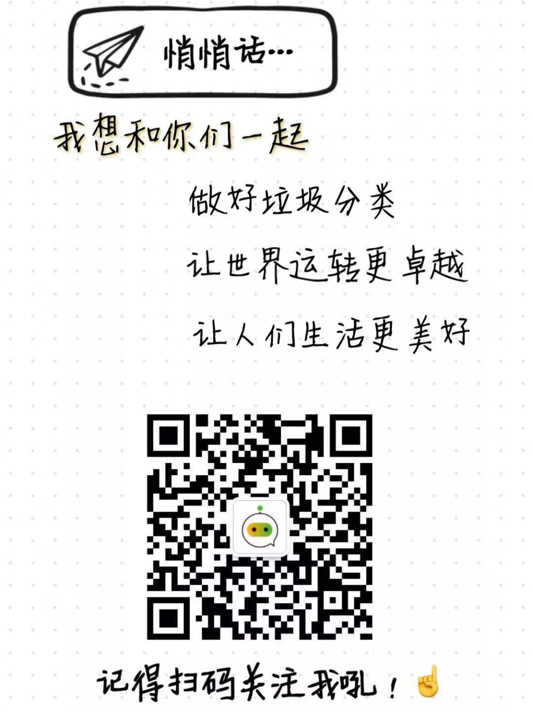

# Waste-Classification-Assistant
We developed a WeChat public account for waste classification.

You can follow our account via WeChat.

We publish our account on July 1st, 2019. More than 1,000 people follow our account in 3 hours. By the end of July 10th, 2019, we got more than 7,000 followers and reply more than 35,000 messages.

 